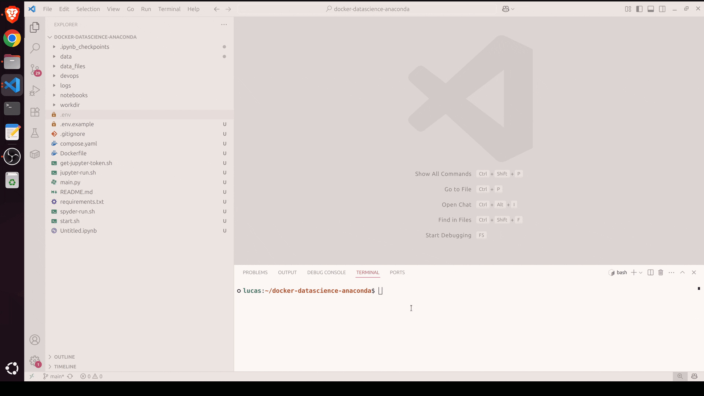

# Projeto: ambiente docker completo para data science e analytics
Instalação em um clique e sem problemas de compatibilidade!<br>

✅ spyder;<br>
✅ jupyter notebook;<br>
✅ mysql;<br>
✅ postgres;<br>
✅ mongodb;<br>
✅ mongodb express (interface gráfica para visualização de dados);<br>
✅ flask e fastapi (disponibilizar gráficos por api);<br>


**⚠️ ATENÇÃO!**<br/>
Antes de continuar para os próximos passos, verifique se o `docker` e o `docker-compose` estão instaldos na sua máquina, utilizando os comandos abaixo:
```bash
docker --version
docker-compose --version
```
Caso os comandos acima não retorne resposta, será necessário instalar o `docker` e o `docker-compose`.

### Passos para executar o projeto:

### 1. Clonar o projeto:
```bash
 git clone git@github.com:lmuffato/docker-data-science-analytics.git
```

# 2. Linux

### Montar o container da aplicação:
#### 2.1. Montar o projeto através do script automatizado `start.sh`:<br>



**⚠️ ATENÇÃO!**<br/>
O script automatizado funciona apenas em ambiente `linux`. <br>

#### 2.2. Abra o terminal na raiz do projeto e execute o comando:
```bash
chmod +x start.sh
```
Observação: Só é necessário conceder permissão uma única vez.<br>

#### 2.3. Executar o script:
```bash
./start.sh
```

✅ Após a execução do script, a aplicação estará pronta e em funcionamento através do container.

# 3. Windows

#### 3.1. Montar o projeto `manualmente` com os comandos docker:

#### 3.2. Criar o arquivo `.env` a partir do `.env.example`:
```bash
cp .env.example .env
```

#### 3.3. Montar o container:
Dentro da pasta backend, digite o comando abaixo:
```bash
docker-compose -p datascience up -d --build
```

#### Em caso de erro ao montar o container, apague o cache do docker e tente novamente:

**⚠️ OBSERVAÇÃO:**<br/>
O nome do container é o mesmo definido no `.env`.

✅ Após a execução dos comandos, a aplicação estará pronta e em funcionamento através do container.

# 5. Spyder:

Basta executar o comando abaixo no terminal:
```
./spyder-run.sh
```

Ou entrar dentro do terminal do container e executar:
```
spyder
```
**⚠️ OBSERVAÇÃO:**<br/>
Na primeira vez que montar o container, você terá que executar o comando abaixo para que o container possa abrir uma janela na máquina host, isso só será necessário uma única vez.

```
xhost +local:docker
```

**⚠️ OBSERVAÇÃO:**<br/>
1. Por padrão, o Spyder usa o diretório de trabalho `home/user`.
Vá em configurações do spyder e mude o diretório para a raiz do projeto, isso vai evitar de ter que declarar o workdir para importar os arquivos e além disso, esse diretório não persiste informações após deletar o container, por isso deve-se usar o diretório padrão da raíz do projeto.

2. As versões mais rescentes do spyder, quase sempre travam ao encerrar ou reiniciar o spyder, sendo necessário encerrar no host ou pausar o container. Um pequeno incoveniente a ser corrigido.

# 6. Jupyter

Para executar o jupyter, basta executar o script abaixo:
```
./jupyter-run.sh
```

O jupyter será disponível no navegador acessível pelo link:
```
http://localhost:8889/tree?
```

Para cancelar o servidor, basta apertar `Ctrl C` no terminal que está executando.

**⚠️ OBSERVAÇÃO:**<br/>
Se o valor de `JUPYTER_REQUIRES_AUTHENTICATION` for `True` no arquivo `.env`, o script irá salvar o link com token de acesso para o jupyter, e é só copia e colar no navegador.

# 7. mongo-express

O mongo-express é uma interface para acessar o banco de dados do mongodb, muito útil pois não depende de instalação na máquina.
Acessível por:
```
http://localhost:8081/
```

# 8. Bancos de dados: `mongodb`, `mysql` e `postgres`:
Caso não vá utilizar esses bancos de dados, pode-se comentar os blocos das imagens no `compose.yaml`, poupando memória.

# INFORMAÇÕES:
A pasta `data_files` tem o propósito de armazenar arquios de dados, como `csv`, `parquet`, `xlsx` e etc... Nada dentro dessa pasta será enviado ao github.

Intercâmbio de IDES:
É possível criar um arquivo no spyder ou jupyter e editar e salvar no VsCode ou outra IDE. O fluxo contrário também é possível.

A pasta `/data/dump_test`, existem arquivos de script.sh que realizam o preenchimento dos bancos de dados com base de dados de teste.
